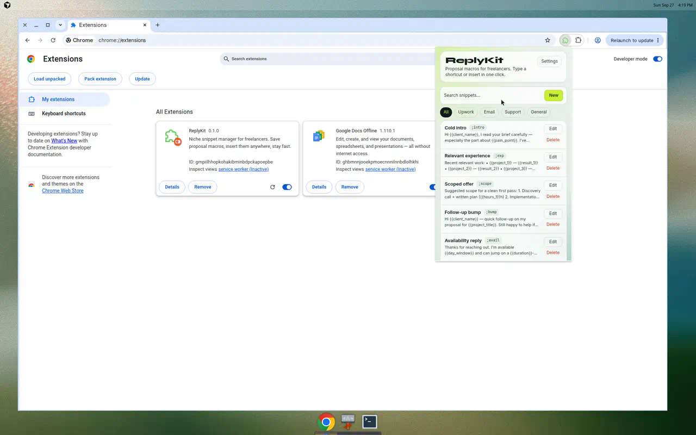

# ReplyKit

**Proposal macros for freelancers.**  
Save snippets, insert them into any text field, or expand shortcuts like `;intro` while typing.

Built for people who write the same Upwork bids, follow-ups, and client replies every week.



## Who it serves

| Audience | Job to be done |
|----------|----------------|
| Upwork / freelance bid writers | Reuse openers, experience blurbs, scoped offers |
| Solo consultants | Availability + follow-up macros |
| Small support freelancers | Ticket acknowledgments and canned replies |

## Features (v0.1)

- CRUD snippets with niches: Upwork / Email / Support / General
- One-click insert into the focused field
- Shortcut expansion (`;intro` + Space / Enter / Tab)
- Upwork starter pack on first run
- Import / export JSON, reset starters
- Local-first (`chrome.storage.local`); Pro sync hook ready

## Stack

| Layer | Choice |
|-------|--------|
| Extension | **WXT** (Manifest V3) |
| UI | **React 19 + TypeScript** |
| Styles | **Tailwind CSS v4** |
| Storage | **`chrome.storage.local`** |
| Monetization path | Lemon Squeezy + sync via `settings.pro` |

## Develop

```bash
npm install
npm run dev
```

```bash
npm test
npm run compile
npm run build   # → .output/chrome-mv3
npm run zip     # Chrome Web Store zip
```

### Load in Chrome

1. `npm run build`
2. Open `chrome://extensions`
3. Enable **Developer mode**
4. **Load unpacked** → select `.output/chrome-mv3`

Chrome 137+ removed `--load-extension` on branded Chrome; Load unpacked is the supported path.

Click-to-insert uses `chrome.scripting` and works on normal pages. Shortcut expansion needs the content script — for `file://` demos, enable **Allow access to file URLs** on the extension details page.

## Monetization path

1. Free local-only on the Chrome Web Store  
2. Lemon Squeezy license → unlock device sync  
3. ~$5–12/mo for sync + shared team libraries  

## License

MIT
